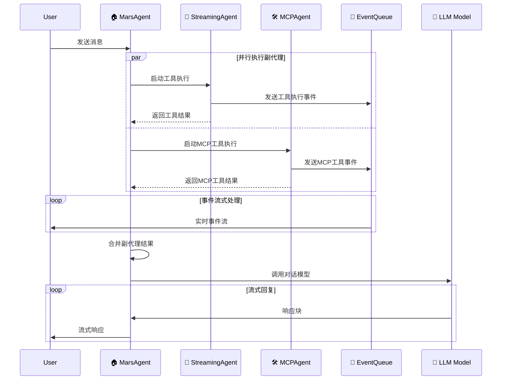

# Mars Agent 架构设计

## 🎯 架构概述

Mars Agent 采用主副代理架构模式，实现清晰的职责分离和集中化管理。

### 📋 架构组件

```
┌─────────────────────────────────────────────────────────────┐
│                    🏠 MarsAgent (主代理)                      │
│  ┌─────────────────────────────────────────────────────────┐ │
│  │ • 统一事件管理和流式响应                                   │ │
│  │ • 最终模型调用和回复生成                                   │ │
│  │ • 协调副代理工作                                         │ │
│  │ • 错误处理和兜底策略                                      │ │
│  └─────────────────────────────────────────────────────────┘ │
│                           ⬆                                  │
│                    📡 事件队列 (Event Queue)                   │
│                    ⬆               ⬆                         │
│  ┌─────────────────────┐     ┌─────────────────────┐          │
│  │ 🔧 StreamingAgent   │     │ 🛠️ MCPAgent        │          │
│  │ (副代理)            │     │ (副代理)           │          │
│  │ • 插件工具执行       │     │ • MCP工具执行      │          │
│  │ • 工具调用决策       │     │ • MCP服务器连接    │          │
│  │ • 事件上报          │     │ • 事件上报         │          │
│  └─────────────────────┘     └─────────────────────┘          │
└─────────────────────────────────────────────────────────────┘
```

## 🏗️ 组件职责

### 🏠 MarsAgent (主代理)

**核心职责:**
- **事件管理**: 统一接收和处理来自副代理的所有事件
- **模型调用**: 负责最终的对话模型调用和响应生成
- **流式处理**: 管理整个对话的流式事件流
- **协调调度**: 并行调度副代理执行任务
- **错误处理**: 统一的错误处理和兜底策略

**主要方法:**
- `astream()`: 流式对话接口，统一事件处理
- `ainvoke()`: 非流式对话接口
- `call_mcp_agent_messages()`: 调度MCP Agent
- `call_stream_agent_messages()`: 调度Stream Agent

### 🔧 StreamingAgent (副代理)

**核心职责:**
- **工具执行**: 负责插件函数和MCP工具的执行
- **工具决策**: 分析用户需求，决定调用哪些工具
- **事件上报**: 将工具执行过程事件发送给主代理
- **结果返回**: 返回工具执行结果给主代理

**主要特点:**
- 不进行模型回复，只负责工具执行
- 所有事件自动发送到主代理事件队列
- 支持插件函数和MCP工具的混合执行

### 🛠️ MCPAgent (副代理)

**核心职责:**
- **MCP连接**: 建立和管理MCP服务器连接
- **MCP工具**: 执行特定MCP服务器的工具
- **事件上报**: 将MCP工具执行过程事件发送给主代理
- **结果返回**: 返回MCP工具执行结果给主代理

**主要特点:**
- 专门处理MCP协议相关的工具调用
- 支持多个MCP服务器的并发处理
- 独立的工具调用决策和执行

## 🔄 工作流程

### 流式对话流程



### 事件流向

```
副代理事件 → 主代理事件队列 → 用户接收

StreamingAgent   ┐
                 ├──→ EventQueue ──→ User
MCPAgent         ┘
```

## 🎨 设计优势

### 1. **职责清晰**
- **主代理**: 专注事件管理和模型调用
- **副代理**: 专注工具执行和结果返回
- **分工明确**: 避免功能重叠和混乱

### 2. **集中管理**
- **统一事件**: 所有事件通过主代理统一处理
- **统一回复**: 所有模型调用由主代理负责
- **统一错误**: 集中的错误处理和兜底策略

### 3. **高度并发**
- **并行执行**: 副代理可以并行工作
- **实时反馈**: 工具执行过程实时反馈给用户
- **流式体验**: 完整的流式交互体验

### 4. **易于扩展**
- **插件化**: 新的副代理可以轻松添加
- **模块化**: 每个代理职责单一，便于维护
- **标准化**: 统一的事件接口和通信协议

## 📝 使用示例

### 基本使用

```python
from mars_agent import MarsAgent, MarsModelConfig, MCPConfig

# 配置模型
model_config = MarsModelConfig(
    model="gpt-3.5-turbo",
    api_key="your-api-key",
    base_url="https://api.openai.com/v1"
)

# 配置MCP服务器
mcp_configs = [
    MCPConfig(
        url="http://localhost:8000",
        type="http",
        server_name="weather_server",
        user_config={"api_key": "weather_key"}
    )
]

# 定义插件函数
def get_time():
    """获取当前时间"""
    return "2024-12-19 10:30:00"

# 初始化主代理
agent = MarsAgent(
    model_config=model_config,
    mcp_configs=mcp_configs,
    functions=[get_time]
)

await agent.init_mars_agent()

# 流式对话
async for event in agent.astream("帮我查看天气和时间"):
    print(f"事件: {event}")
```

### 事件类型

主代理会产生以下类型的事件：

- **`heartbeat`**: 心跳事件，保持连接活跃
- **`progress`**: 进度事件，显示各个阶段的执行状态
- **`response_chunk`**: 响应块事件，流式模型回复
- **`error`**: 错误事件，工具执行或模型调用错误

## 🔮 未来扩展

该架构支持以下扩展：

1. **新的副代理类型**: 可以轻松添加新的专门化副代理
2. **事件类型扩展**: 支持更多类型的事件和数据
3. **多模型支持**: 主代理可以支持多种不同的模型
4. **分布式部署**: 副代理可以部署在不同的服务器上

---

**设计理念**: 通过清晰的职责分离和统一的事件管理，构建一个高效、可扩展、易维护的AI代理系统。 