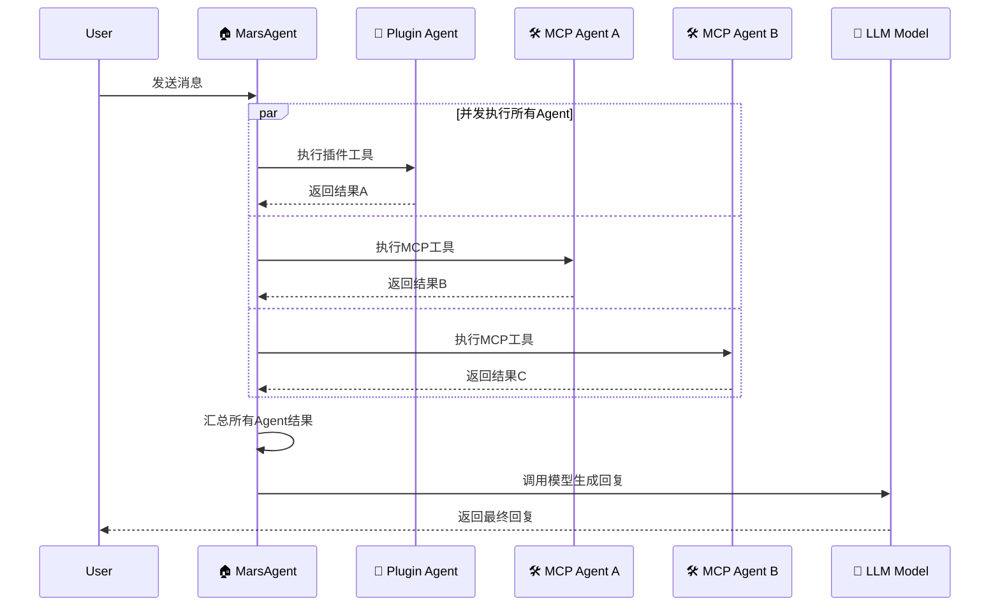
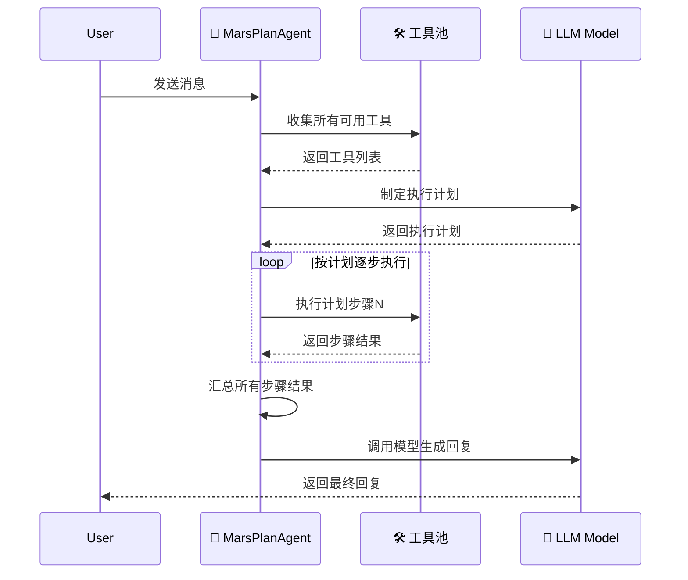

# Mars Agent 架构设计

> GitHub仓库：https://github.com/Shy2593666979/Mars-Agent

## 🎯 架构概述

Mars Agent 提供两种不同的Agent执行策略，满足不同的使用场景：

1. **MarsAgent**: 并发执行策略 - 将每个MCP服务器和插件集合当作独立Agent并发执行
2. **MarsPlanAgent**: 规划执行策略 - 先制定执行计划，再按计划逐步调用工具

### 📋 MarsAgent 架构 (并发执行)

```
┌─────────────────────────────────────────────────────────────┐
│                    🏠 MarsAgent (主控制器)                    │
│  ┌─────────────────────────────────────────────────────────┐ │
│  │ • 并发调度多个Agent                                      │ │
│  │ • 汇总所有Agent结果                                      │ │
│  │ • 统一模型调用和回复                                      │ │
│  │ • 流式事件管理                                          │ │
│  └─────────────────────────────────────────────────────────┘ │
│                           ⬆                                  │
│                    📡 事件汇聚 (Event Aggregation)             │
│    ⬆              ⬆              ⬆              ⬆            │
│ ┌─────────┐  ┌─────────┐  ┌─────────┐  ┌─────────┐           │
│ │🔧 Plugin│  │🛠️ MCP-A │  │🛠️ MCP-B │  │🛠️ MCP-C │           │
│ │ Agent   │  │ Agent   │  │ Agent   │  │ Agent   │           │
│ │• 插件集合│  │• 地图服务│  │• 办公服务│  │• 其他...│           │
│ │• 工具执行│  │• 工具执行│  │• 工具执行│  │• 工具执行│           │
│ └─────────┘  └─────────┘  └─────────┘  └─────────┘           │
│        并发执行 (Concurrent Execution)                       │
└─────────────────────────────────────────────────────────────┘
```

### 📋 MarsPlanAgent 架构 (规划执行)

```
┌─────────────────────────────────────────────────────────────┐
│                  🧠 MarsPlanAgent (规划控制器)                 │
│  ┌─────────────────────────────────────────────────────────┐ │
│  │ Step 1: 🔍 收集所有可用工具                              │ │
│  │ Step 2: 🤖 LLM制定执行计划                               │ │
│  │ Step 3: ⚡ 按计划逐步执行                                │ │
│  │ Step 4: 📊 汇总结果并回复                                │ │
│  └─────────────────────────────────────────────────────────┘ │
│                                                             │
│  📋 Planning Phase (计划阶段)                                │
│  ┌─────────────────────────────────────────────────────────┐ │
│  │ 🛠️ 所有MCP工具 + 🔧 插件工具 → 🤖 LLM → 📝 执行计划     │ │
│  └─────────────────────────────────────────────────────────┘ │
│                           ⬇                                  │
│  ⚡ Execution Phase (执行阶段)                                │
│  ┌─────────────────────────────────────────────────────────┐ │
│  │ 📝 Plan Step 1 → 🔧 Tool Call → ✅ Result              │ │
│  │ 📝 Plan Step 2 → 🔧 Tool Call → ✅ Result              │ │
│  │ 📝 Plan Step N → 🔧 Tool Call → ✅ Result              │ │
│  └─────────────────────────────────────────────────────────┘ │
│                     Sequential Execution                     │
└─────────────────────────────────────────────────────────────┘
```

## 🏗️ 核心差异对比

| 特性 | MarsAgent (并发执行) | MarsPlanAgent (规划执行) |
|------|---------------------|------------------------|
| **执行策略** | 并发执行所有Agent | 先规划后按步骤执行 |
| **Agent划分** | 每个MCP服务器 + 插件集合 | 统一工具池 |
| **适用场景** | 独立任务、快速响应 | 复杂流程、依赖任务 |
| **执行效率** | 高并发，速度快 | 有序执行，逻辑清晰 |
| **工具协调** | 无协调，独立执行 | 智能协调，步骤优化 |

## 🔄 执行流程对比

### MarsAgent 执行流程



### MarsPlanAgent 执行流程



## 🎨 设计优势

### MarsAgent 优势
- **高并发**: 多Agent并发执行，响应速度快
- **资源隔离**: 每个MCP服务独立Agent，故障隔离
- **扩展性强**: 新增MCP服务即新增Agent
- **适合独立任务**: 无依赖关系的工具调用

### MarsPlanAgent 优势
- **智能规划**: LLM制定最优执行计划
- **步骤协调**: 处理有依赖关系的复杂任务
- **逻辑清晰**: 按计划有序执行，便于调试
- **适合复杂流程**: 多步骤、有依赖的任务场景

## 📦 安装

```bash
pip install git+https://github.com/Shy2593666979/Mars-Agent

# 或者

pip install mars-agent
```

## 📝 使用示例

### MarsAgent (并发执行) 示例

```python
import asyncio
from datetime import datetime

from mars_agent import MarsAgent
from mars_agent.schema import MarsModelConfig, MCPSSEConfig, MarsResponseChunk

# 定义自定义函数
def get_current_time():
    """获取当前时间"""
    return datetime.now().strftime('%Y-%m-%d %H:%M:%S')

def test_weather(location: str):
    """查询指定地点的天气信息"""
    return f"The weather in {location} is sunny, 25°C"

async def main():
    # 初始化MarsAgent
    agent = MarsAgent(
        # 工具调用模型配置（可选配置，若不指定tool call模型，默认工具调用和对话模型使用同一个）
        tool_call_model_config=MarsModelConfig(
            model="qwen-plus",
            api_key="your-api-key",
            base_url="https://dashscope.aliyuncs.com/compatible-mode/v1"
        ),
        # 对话模型配置
        model_config=MarsModelConfig(
            model="qwen-plus", 
            api_key="your-api-key",
            base_url="https://dashscope.aliyuncs.com/compatible-mode/v1"
        ),
        # 自定义函数（将作为一个Plugin Agent）
        functions=[get_current_time, test_weather],
        # MCP服务器配置（每个MCP服务器将作为一个独立Agent）
        mcp_configs=[
            MCPSSEConfig(
                server_name="地图服务",
                url="https://your-mcp-server.com/sse",
            ),
            MCPSSEConfig(
                server_name="办公服务",
                url="https://your-office-server.com/sse",
                personal_config={
                    "app_id": "your-app-id", 
                    "app_secret": "your-app-secret"
                }
            )
        ]
    )

    # 并发执行 - 所有Agent同时工作
    print("=== 并发执行示例 ===")
    async for chunk in agent.astream("你好，请问北京的天气怎么样？现在几点了？"):
        if isinstance(chunk, MarsResponseChunk):
            print(chunk.data.content, end="")

if __name__ == "__main__":
    asyncio.run(main())
```

### MarsPlanAgent (规划执行) 示例

```python
from mars_agent import MarsPlanAgent
from mars_agent.schema import MarsModelConfig, MCPSSEConfig, MarsProgressChunk

async def plan_agent_example():
    # 初始化MarsPlanAgent
    plan_agent = MarsPlanAgent(
        tool_call_model_config=MarsModelConfig(
            model="qwen-plus",
            api_key="your-api-key", 
            base_url="https://dashscope.aliyuncs.com/compatible-mode/v1"
        ),
        model_config=MarsModelConfig(
            model="qwen-plus",
            api_key="your-api-key",
            base_url="https://dashscope.aliyuncs.com/compatible-mode/v1"
        ),
        mcp_configs=[
            MCPSSEConfig(
                server_name="地图服务",
                url="https://your-mcp-server.com/sse"
            ),
            MCPSSEConfig(
                server_name="网页抓取",
                url="https://your-fetch-server.com/sse"
            )
        ]
    )

    # 规划执行 - 先制定计划，再逐步执行
    print("=== 规划执行示例 ===")
    async for chunk in plan_agent.astream("帮我查询北京到上海的路线，然后抓取相关的交通信息网页"):
        if isinstance(chunk, MarsProgressChunk):
            print(f"执行进度: {chunk}")
        elif isinstance(chunk, MarsResponseChunk):
            print(chunk.data.accumulated)
```

### MCP配置选项

```python
from mars_agent.schema import MCPSSEConfig, MCPStdioConfig

# SSE方式连接MCP服务器
sse_config = MCPSSEConfig(
    server_name="服务器名称",
    url="https://your-server.com/sse",
    personal_config={
        "api_key": "your-api-key",
        "other_param": "value"
    }
)

# Stdio方式连接MCP服务器
stdio_config = MCPStdioConfig(
    server_name="本地服务",
    command="python",
    args=["-m", "your_mcp_server"],
    env={"API_KEY": "your-api-key"}
)
```

### 响应类型处理

```python
from mars_agent import MarsResponseChunk
from mars_agent.schema import MarsProgressChunk

async for chunk in agent.astream("你的问题"):
    # 进度事件 (MarsPlanAgent特有)
    if isinstance(chunk, MarsProgressChunk):
        print(f"执行进度: {chunk.message}")
    
    # 响应内容
    elif isinstance(chunk, MarsResponseChunk):
        print(f"回复: {chunk.data.content}")
    
    # 其他事件类型
    else:
        print(f"事件: {chunk}")
```

### 选择使用建议

#### 使用 MarsAgent 的场景
- 需要快速并发执行多个独立工具
- 工具之间无依赖关系
- 追求响应速度
- 简单的多工具调用场景

#### 使用 MarsPlanAgent 的场景
- 需要处理复杂的多步骤任务
- 工具调用之间有依赖关系
- 需要智能规划执行顺序
- 追求执行逻辑的清晰性

### 事件类型

主Agent会产生以下类型的事件：

- **`MarsProgressChunk`**: 进度事件，显示各个阶段的执行状态（MarsPlanAgent特有）
- **`MarsResponseChunk`**: 响应块事件，流式模型回复内容
- **`heartbeat`**: 心跳事件，保持连接活跃  
- **`error`**: 错误事件，工具执行或模型调用错误

### 配置选项

#### 模型配置

```python
from mars_agent.schema import MarsModelConfig

# 基本配置
model_config = MarsModelConfig(
    model="qwen-plus",
    api_key="your-api-key",
    base_url="https://dashscope.aliyuncs.com/compatible-mode/v1"
)

# 高级配置
advanced_config = MarsModelConfig(
    model="gpt-4",
    api_key="your-openai-key", 
    base_url="https://api.openai.com/v1",
    temperature=0.7
)
```

#### 主Agent高级配置

```python
agent = MarsAgent(
    model_config=model_config,
    tool_call_model_config=tool_call_config,  # 可使用不同的模型进行工具调用
    functions=[your_functions],
    mcp_configs=[mcp_configs],
    mcp_as_agent=False,  # 是否将MCP作为Agent单独使用，这里默认为True
)
```

---

**设计理念**: 通过并发执行和规划执行两种策略，为不同复杂度的任务提供最优的解决方案。

